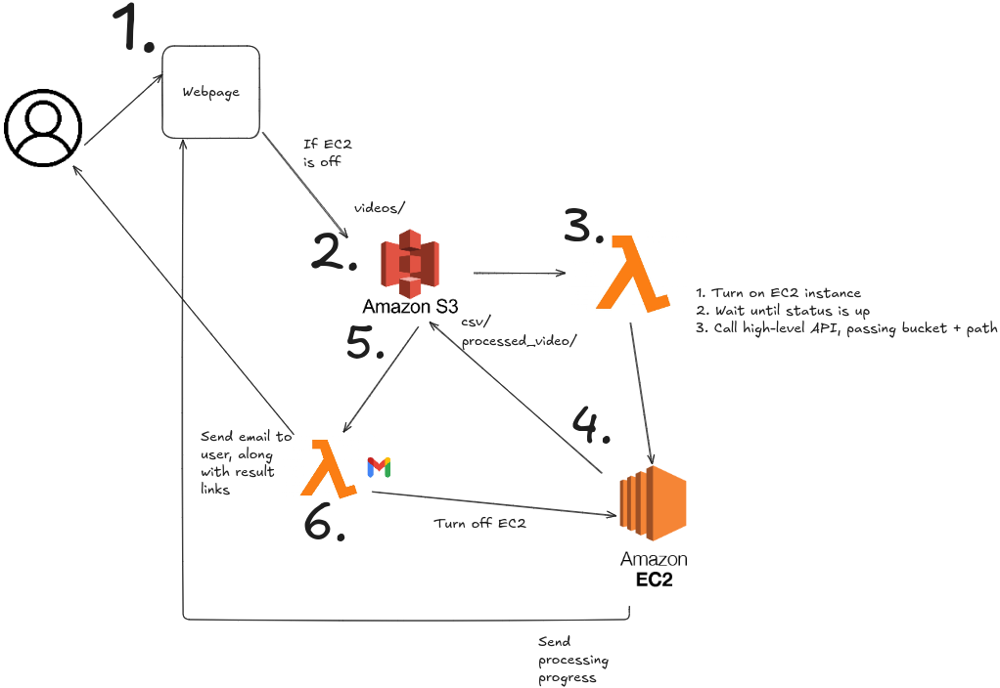

# Traffic conflict analysis using computer vision (TCA-CV)

This repository aims to develop a methodology to estimate the severity of traffic conflicts using computer vision.

## Overall Architecure

The architecture of the solution is mainly event-driven, where the main steps are divided and each of them triggers the next upon completion. The only step where the user interaction is needed is the first one, which is triggered using our Website UI. 

Explanation of each step:

1. The first step consists of the user entering and uploading the video using the [webpage](https://tca.mexico.itdp.org/). The video must follow the characteristics mentioned in the webpage. In addition, the current implementation can only handle the processing of one video at the time. Thus, video upload will be blocked if the EC2 instance is processing a video.

2. Upload file to S3. The file is uploaded to a bucket, under the `videos` directory.

3. The file upload triggers the execution of a lambda, which turns on the EC2 instance, awaits the API, and then makes the required call.

4. The EC2 instance performs the required processing of the provided videos, and uploads the results to `processed_video/` and `csvs/`.

5. The files uploaded to the bucket trigger the execution of a lambda function.

6. The lambda function sends an email to the user, indicating that the results are ready for review.

