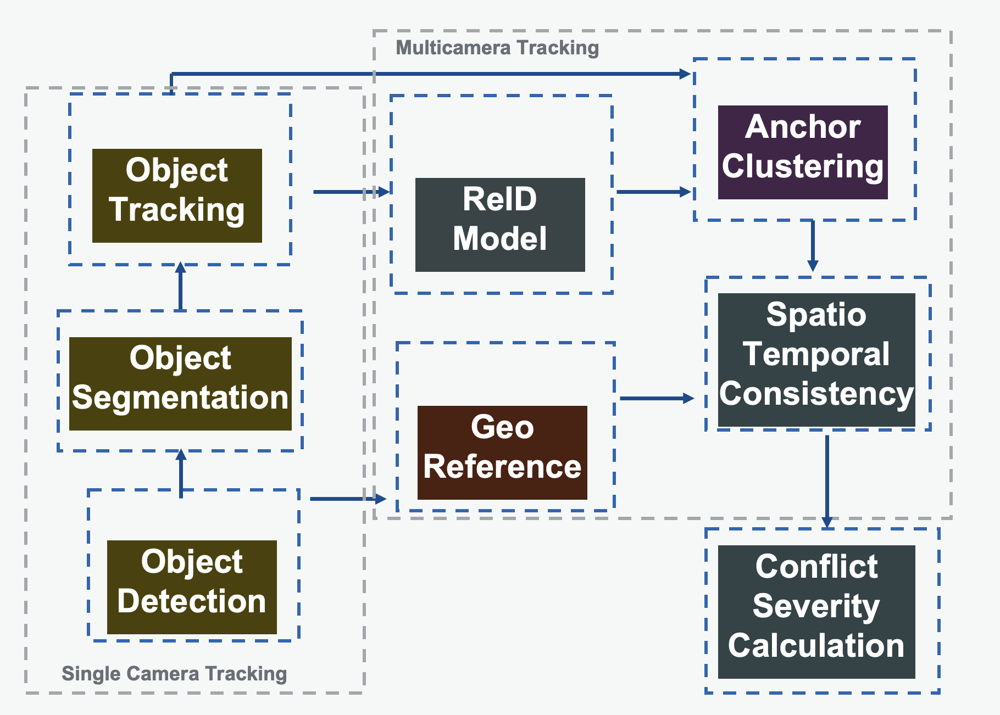

# Traffic conflict analysis using computer vision (TCA-CV)

This repository aims to develop a methodology estimate the severity of traffic conflicts using computer vision.

## Overall methodology



## Run locally with Nvidia GPU

Create RAPIDS environment
```bash
conda env create -f environment.yml
```
Activate environment
```bash
conda activate rapids
```


## References

